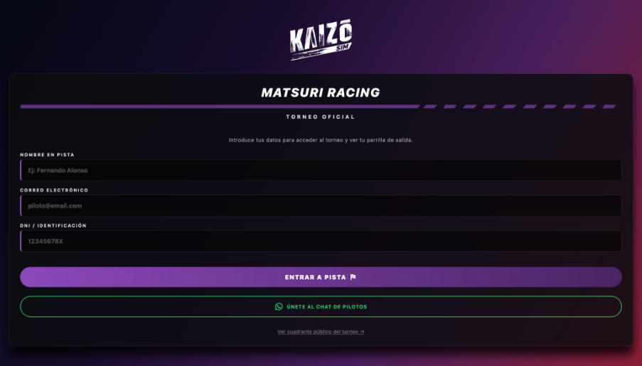
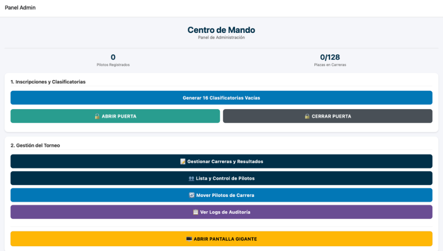
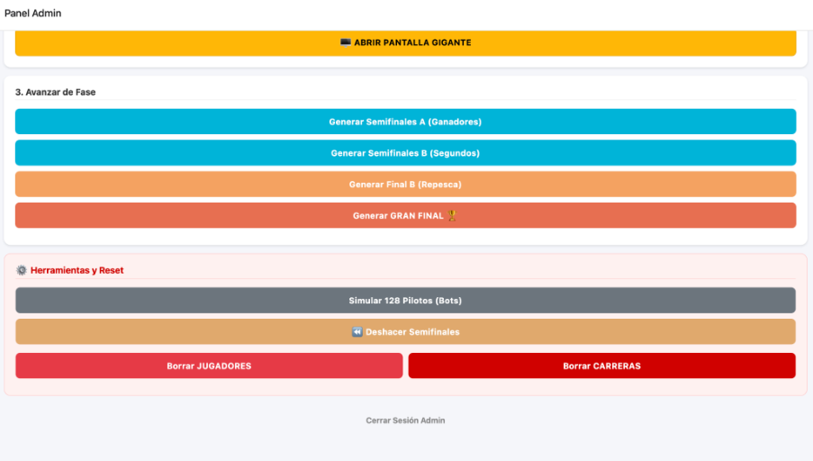

# 🏁 Matsuri Racing — Kaizō Sim


Plataforma para gestionar torneos de **SimRacing**, desarrollada para **Kaizō Sim**. Centraliza inscripciones, carreras, clasificación entre rondas y resultados en tiempo real para organizadores, pilotos y espectadores.

**[🚀 Abrir aplicación](https://torneo-matsuri.vercel.app/)** · **[📄 Ver manual](docs/kaizo-sim-aplicacion.pdf)** · **[⬇️ Obtener PDF](https://github.com/josealonsogt/torneo-f1-app/raw/refs/heads/main/docs/kaizo-sim-aplicacion.pdf)**

## 📸 Capturas

### Acceso al torneo



### Centro de Mando



### Generación de rondas y herramientas



## 🔐 Acceso al panel de administración

En el formulario de entrada introduce:

| Campo de la aplicación | Valor |
| --- | --- |
| Nombre | `admin` |
| Correo electrónico | `admin@torneo.com` |
| DNI | `admin` |

El manual original llama «contraseña» al último valor, pero la pantalla utiliza el **campo DNI**. Este acceso está implementado en `screens/usuarios/LoginScreen.tsx`.

Los pilotos acceden con nombre, correo y DNI. El DNI identifica su perfil: introducir uno que ya esté registrado recupera ese piloto, aunque se escriban otros valores de nombre o correo.

> El acceso administrativo publicado permite modificar el torneo. Para utilizarlo como demo pública, la instancia de Firebase debe contener únicamente datos ficticios. La documentación oculta los datos personales de las capturas; esto no modifica los datos de la aplicación desplegada.

## 🏎️ Funcionalidades

### 👑 Administración

- Creación de las 16 clasificatorias iniciales y apertura o cierre de inscripciones.
- Gestión de pilotos y carreras, registro de posiciones y DNF.
- Generación de semifinales, repesca y Gran Final.
- Movimiento manual de pilotos entre carreras.
- Registro de acciones en logs de auditoría.
- Exportación de resultados en CSV.
- Preparación de avisos mediante WhatsApp.
- Simulación de participantes, deshacer semifinales y reinicio del torneo.

### 🚦 Box del piloto

- Estado del participante y fase del torneo.
- Carrera asignada e historial de posiciones.
- Acceso al bracket y a los resultados de las demás carreras.

### 📺 Live Timing y pantalla gigante

- Resultados actualizados mediante Cloud Firestore.
- Vista del cuadro de clasificatorias, semifinales, repesca y final.
- Presentación del torneo para móviles y pantallas de eventos.

## 🧠 Progresión del torneo

El código actual aplica estas reglas al guardar los resultados de cada carrera:

| Ronda | Posiciones que avanzan | Destino |
| --- | --- | --- |
| Clasificatoria | 1.º | Semifinal A |
| Clasificatoria | 2.º | Semifinal B |
| Semifinal A | 1.º a 3.º | Gran Final |
| Semifinal B | 1.º a 4.º | Repesca / Final B |
| Repesca / Final B | 1.º y 2.º | Gran Final |

Las semifinales distribuyen a los clasificados en dos carreras por grupo. Deben guardarse los resultados de la ronda anterior antes de generar la siguiente.

La implementación está en `screens/admin/GestionCarrerasScreen.tsx` y `services/torneoService.ts`. El manual conserva las capturas del evento original; su descripción de la Semifinal B debe interpretarse conforme a la tabla anterior.

## 🛠️ Tecnologías y estructura

- React Native, Expo SDK 54, React 19 y TypeScript / JavaScript.
- React Navigation para la navegación.
- Firebase y Cloud Firestore para los datos y actualizaciones en tiempo real.
- Despliegue web en Vercel.

| Directorio | Responsabilidad |
| --- | --- |
| `screens/admin/` | Administración y pantalla grande |
| `screens/usuarios/` | Acceso, box y vistas del torneo |
| `services/` | Firebase y lógica del torneo |
| `navigation/` | Navegación de la aplicación |
| `config/` | Configuración visual del torneo |
| `types/` | Tipos de datos |
| `docs/` | Manual público y capturas |

## ⚙️ Ejecutar en local

Utiliza una versión de Node.js compatible con Expo SDK 54.

```bash
git clone https://github.com/josealonsogt/torneo-f1-app.git
cd torneo-f1-app
npm install
cp .env.example .env
```

Completa `.env` con la configuración de tu propia aplicación web de Firebase. Las seis variables `EXPO_PUBLIC_FIREBASE_*` del ejemplo se leen en `services/firebaseConfig.js`.

```bash
npm run web
```

También existen `npm run android`, `npm run ios` y `npm run build` para los entornos y la exportación web de Expo.

Las variables `EXPO_PUBLIC_*` forman parte del cliente compilado. No deben contener claves privadas, cuentas de servicio ni secretos de servidor. El acceso a los datos debe limitarse mediante las reglas de Firestore de la instancia utilizada.

## 📄 Documentación

El [manual público](docs/kaizo-sim-aplicacion.pdf) reúne explicaciones y capturas del funcionamiento. Los datos personales se han eliminado de la versión distribuida. El enlace directo al PDF puede abrirlo en el navegador o descargarlo, según su configuración.

## 🎯 Contexto y autor

Proyecto desarrollado para una necesidad real: coordinar un torneo de SimRacing y mantener sincronizados organizadores, pilotos y espectadores. Su principal reto es gestionar el avance entre rondas y combinar administración con seguimiento en directo.

Desarrollado por **[josealonsogt](https://github.com/josealonsogt)**.
